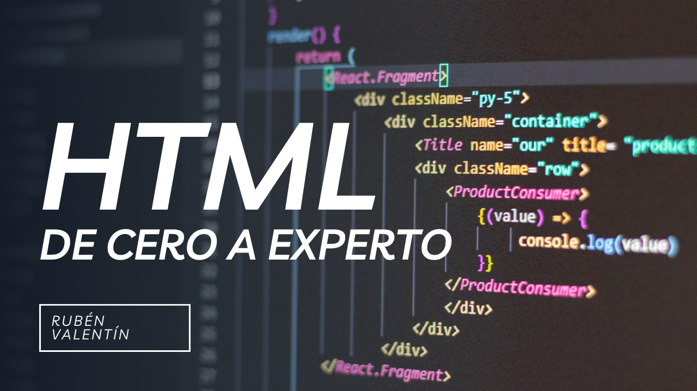

  

# Curso-HTML

# Índice del curso

## 1. HTML Básico
1. **Qué es HTML**  
   Explicación general de HTML, su origen y función principal en la web.  
2. **Estructura inicial**  
   Cómo construir un documento HTML básico paso a paso.  
3. **Elementos fundamentales**  
   Introducción a las partes principales que componen HTML.  
4. **Personalización con atributos**  
   Uso de propiedades para ajustar el comportamiento de los elementos.  
5. **Títulos en HTML**  
   Cómo estructurar los encabezados de contenido.  
6. **Creación de párrafos**  
   Uso adecuado de bloques de texto para presentar información.  
7. **Aplicar estilo al texto**  
   Técnicas para resaltar palabras o frases dentro de tu contenido.  
8. **Notas en el código**  
   Inclusión de comentarios para mejorar la claridad del desarrollo.  
9. **Navegación con enlaces**  
   Creación de vínculos para mover al usuario entre páginas.  
10. **Uso de imágenes**  
    Cómo agregar y ajustar imágenes en tus páginas web.  
11. **Organización con tablas**  
    Estructura y despliegue de datos en formato tabular.  
12. **Creación de listas**  
    Generación de listas numeradas y con viñetas para organizar contenido.  

## 2. Formularios
1. **Qué son los formularios**  
   Introducción al propósito y funcionalidad de los formularios en HTML.  
2. **Partes de un formulario**  
   Explicación de las principales etiquetas que componen los formularios.  
3. **Entradas comunes**  
   Diferentes tipos de campos de entrada que puedes utilizar.  
4. **Configuración de entradas**  
   Personalización de campos con atributos específicos.  

## 3. Media en HTML
1. **Integración de vídeo**  
   Agregar y configurar contenido de vídeo en tu sitio.  
2. **Uso de audio**  
   Cómo incluir y personalizar archivos de audio en tus páginas.  
3. **Contenido de YouTube**  
   Incorporación de vídeos de YouTube mediante elementos HTML.  

## 4. HTML Avanzado
1. **Citas y referencias**  
   Manejo de texto citado o mencionado con etiquetas específicas.  
2. **Imágenes interactivas**  
   Creación de áreas clicables en imágenes.  
3. **Imágenes adaptativas**  
   Uso del elemento `<picture>` para mostrar imágenes según el dispositivo.  
4. **Tipos de elementos HTML**  
   Diferencia entre elementos que ocupan bloques completos y aquellos en línea.  
5. **Incorporar contenido externo**  
   Uso de iframes para insertar recursos externos en la página.  
6. **La sección head**  
   Elementos clave dentro del `<head>` y su impacto en el sitio.  
7. **Diseño de página**  
   Técnicas para crear estructuras organizadas y visualmente atractivas.  
8. **Mostrar código**  
   Etiquetas que ayudan a incluir y dar formato a fragmentos de código.  
9. **Estructura semántica**  
   Importancia de los elementos semánticos para accesibilidad y optimización.  
10. **Caracteres especiales**  
    Cómo utilizar entidades para representar símbolos en HTML.  
11. **Añadir emojis**  
    Métodos para incluir íconos y emojis en tu contenido.  
12. **Buenas prácticas**  
    Reglas y consejos para escribir un código HTML claro y eficiente.

## 5. Ejercicios Prácticos

### 5.1 Ejercicios de HTML Básico

Ejercicios Prácticos de HTML

## 6. Proyectos Completos

### 6.1 Proyecto: Portfolio Personal

Proyecto Portfolio Personal

## 7. Mejores Prácticas y Optimización

### 7.1 Mejores Prácticas de HTML

1.  Estructura y Organización
    -   Usa una estructura clara y consistente
    -   Mantén una indentación adecuada
    -   Agrupa elementos relacionados en secciones
2.  Semántica
    -   Utiliza elementos HTML5 semánticos apropiados
    -   Evita el uso excesivo de divs
    -   Asegura que los encabezados sigan una jerarquía lógica
3.  Accesibilidad
    -   Incluye atributos alt en imágenes
    -   Usa etiquetas label en formularios
    -   Asegura un contraste adecuado
    -   Implementa ARIA roles cuando sea necesario
4.  Rendimiento
    -   Optimiza las imágenes
    -   Usa lazy loading para imágenes
    -   Minimiza el uso de iframes
    -   Evita scripts bloqueantes

## 8. Guía de Resolución de Problemas Comunes

### 8.1 Problemas Frecuentes y Soluciones

## 9. Recursos Adicionales

### 9.1 Herramientas Útiles

-   Validador W3C: [https://validator.w3.org/](https://validator.w3.org/)
-   Can I Use: [https://caniuse.com/](https://caniuse.com/)
-   HTML5 Please: [https://html5please.com/](https://html5please.com/)

### 9.2 Documentación

-   MDN Web Docs
-   W3Schools
-   HTML Living Standard

### 9.3 Comunidades

-   Stack Overflow
-   GitHub
-   Dev.to